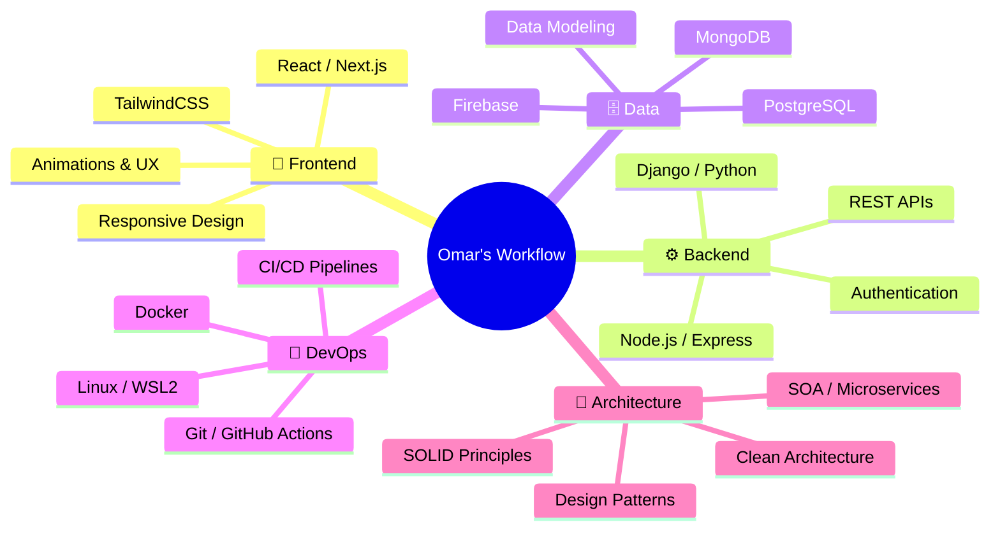

<div align="center">

<!-- ═══════════════════════════════════════════════════════════════════ -->
<!-- 🌊 ANIMATED HEADER WAVE -->
<!-- ═══════════════════════════════════════════════════════════════════ -->


<!-- ═══════════════════════════════════════════════════════════════════ -->
<!-- ⌨️ TYPING SVG ANIMATION -->
<!-- ═══════════════════════════════════════════════════════════════════ -->

[](https://git.io/typing-svg)

<!-- ═══════════════════════════════════════════════════════════════════ -->
<!-- 🔗 SOCIAL BADGES -->
<!-- ═══════════════════════════════════════════════════════════════════ -->

<a href="https://omarh-portafolio-web.vercel.app/">
  
</a>&nbsp;
<a href="https://linkedin.com/in/omarhernandezrey">
  
</a>&nbsp;
<a href="https://github.com/omarhernandezrey">
  
</a>&nbsp;
<a href="mailto:contact@omarhernandez.dev">
  
</a>

<br/>

<!-- Profile Views Counter -->

&nbsp;


</div>

<!-- ═══════════════════════════════════════════════════════════════════ -->
<!-- 🧑‍💻 ABOUT ME -->
<!-- ═══════════════════════════════════════════════════════════════════ -->


## 🧑‍💻 &nbsp;About Me

```yaml
name: Omar Alberto Hernández Rey
location: Bogotá, Colombia 🇨🇴
role: Full Stack Developer
education: Politécnico Grancolombiano
current_focus:
  - Mobile Development (Android/Java)
  - Software Architecture & Design Patterns
  - Scalable Web Applications
languages: [Spanish (Native), English]
fun_fact: "I automate everything I can — even my README updates."
```

- 🔭 &nbsp;Currently working on **interactive educational platforms**
- 🌱 &nbsp;Learning **Software Architecture**, **Mobile Development** & **SOA Patterns**
- 🏗️ &nbsp;Building with **React**, **Next.js**, **Node.js**, **Django**
- ⚡ &nbsp;Passionate about **clean code**, **design patterns** & **developer experience**
- 🎯 &nbsp;2026 Goals: **Contribute to Open Source** & **Launch SaaS projects**

<br clear="both"/>

---

<!-- ═══════════════════════════════════════════════════════════════════ -->
<!-- 🛠️ TECH STACK — SKILL ICONS -->
<!-- ═══════════════════════════════════════════════════════════════════ -->

<div align="center">

## 🛠️ &nbsp;Tech Arsenal

<br/>

### 🎨 Frontend
<a href="https://skillicons.dev">
  
</a>

### ⚙️ Backend
<a href="https://skillicons.dev">
  
</a>

### 🗄️ Databases
<a href="https://skillicons.dev">
  
</a>

### 🚀 DevOps & Tools
<a href="https://skillicons.dev">
  
</a>

</div>

---

<!-- ═══════════════════════════════════════════════════════════════════ -->
<!-- 📊 GITHUB ANALYTICS DASHBOARD -->
<!-- ═══════════════════════════════════════════════════════════════════ -->

<div align="center">

## 📊 &nbsp;GitHub Analytics

<br/>

<!-- Stats Card + Languages Card side by side -->
<a href="https://github.com/omarhernandezrey">
  
  &nbsp;
  
</a>

<br/><br/>

<!-- Streak Stats -->
<a href="https://github.com/omarhernandezrey">
  
</a>

<br/><br/>

<!-- Activity Graph -->
<a href="https://github.com/omarhernandezrey">
  
</a>

</div>

---

<!-- ═══════════════════════════════════════════════════════════════════ -->
<!-- 🏆 GITHUB TROPHIES -->
<!-- ═══════════════════════════════════════════════════════════════════ -->

<div align="center">

## 🏆 &nbsp;GitHub Trophies

<br/>

<a href="https://github.com/omarhernandezrey">
  
</a>

</div>

---

<!-- ═══════════════════════════════════════════════════════════════════ -->
<!-- 📂 FEATURED PROJECTS -->
<!-- ═══════════════════════════════════════════════════════════════════ -->

<div align="center">

## ⭐ &nbsp;Featured Projects

<br/>

<a href="https://omarh-portafolio-web.vercel.app/">
  
</a>

<!-- Add more pinned repos below as needed -->
<!-- 
<a href="https://github.com/omarhernandezrey/REPO_NAME">
  
</a>
-->

</div>

---

<!-- ═══════════════════════════════════════════════════════════════════ -->
<!-- 🐍 SNAKE CONTRIBUTION ANIMATION -->
<!-- ═══════════════════════════════════════════════════════════════════ -->

<div align="center">

## 🐍 &nbsp;Watch the Snake Eat My Contributions

<br/>

<picture>
  <source media="(prefers-color-scheme: dark)" srcset="https://raw.githubusercontent.com/omarhernandezrey/omarhernandezrey/output/github-contribution-grid-snake-dark.svg" />
  <source media="(prefers-color-scheme: light)" srcset="https://raw.githubusercontent.com/omarhernandezrey/omarhernandezrey/output/github-contribution-grid-snake.svg" />
  
</picture>

</div>

<!--
╔══════════════════════════════════════════════════════════════════════╗
║  🐍 TO ENABLE THE SNAKE ANIMATION:                                  ║
║                                                                      ║
║  1. Create the file:                                                 ║
║     .github/workflows/snake.yml                                      ║
║     in your profile repo (omarhernandezrey/omarhernandezrey)         ║
║                                                                      ║
║  2. Paste this content:                                              ║
║                                                                      ║
║  name: Generate Snake                                                ║
║  on:                                                                 ║
║    schedule:                                                         ║
║      - cron: "0 */6 * * *"                                          ║
║    workflow_dispatch:                                                ║
║                                                                      ║
║  jobs:                                                               ║
║    build:                                                            ║
║      runs-on: ubuntu-latest                                          ║
║      steps:                                                          ║
║        - uses: Platane/snk@v3                                        ║
║          with:                                                       ║
║            github_user_name: omarhernandezrey                        ║
║            outputs: |                                                ║
║              dist/github-contribution-grid-snake.svg                 ║
║              dist/github-contribution-grid-snake-dark.svg            ║
║                ?palette=github-dark                                  ║
║        - uses: crazy-max/ghaction-github-pages@v3.1.0                ║
║          with:                                                       ║
║            target_branch: output                                     ║
║            build_dir: dist                                           ║
║          env:                                                        ║
║            GITHUB_TOKEN: ${{ secrets.GITHUB_TOKEN }}                 ║
║                                                                      ║
║  3. Go to repo Settings > Actions > General                          ║
║     → Set "Workflow permissions" to "Read and write"                  ║
║  4. Run the workflow manually the first time                          ║
╚══════════════════════════════════════════════════════════════════════╝
-->

---

<!-- ═══════════════════════════════════════════════════════════════════ -->
<!-- 📋 SUMMARY CARDS -->
<!-- ═══════════════════════════════════════════════════════════════════ -->

<div align="center">

## 📋 &nbsp;Profile Summary

<br/>

<a href="https://github.com/omarhernandezrey">
  
</a>

<br/><br/>

<a href="https://github.com/omarhernandezrey">
  
  
  
</a>

</div>

---

<!-- ═══════════════════════════════════════════════════════════════════ -->
<!-- 💼 EXPERIENCE & WORKFLOW -->
<!-- ═══════════════════════════════════════════════════════════════════ -->

<div align="center">

## 💼 &nbsp;How I Work

</div>



---

<!-- ═══════════════════════════════════════════════════════════════════ -->
<!-- 🎵 SPOTIFY / RANDOM DEV QUOTE -->
<!-- ═══════════════════════════════════════════════════════════════════ -->

<div align="center">

## 💭 &nbsp;Random Dev Quote

<br/>

<a href="https://github.com/omarhernandezrey">
  
</a>

</div>

---

<!-- ═══════════════════════════════════════════════════════════════════ -->
<!-- 🤝 LET'S CONNECT -->
<!-- ═══════════════════════════════════════════════════════════════════ -->

<div align="center">

## 🤝 &nbsp;Let's Connect

<br/>

<a href="https://omarh-portafolio-web.vercel.app/">
  
</a>&nbsp;
<a href="https://linkedin.com/in/omarhernandezrey">
  
</a>&nbsp;
<a href="mailto:contact@omarhernandez.dev">
  
</a>&nbsp;
<a href="https://github.com/omarhernandezrey">
  
</a>

<br/><br/>

### 💡 Open to collaborations on innovative projects!

<br/>

> _"First, solve the problem. Then, write the code."_ — **John Johnson**

<br/>


</div>

<!-- ═══════════════════════════════════════════════════════════════════ -->
<!-- 💖 MADE WITH LOVE -->
<!-- ═══════════════════════════════════════════════════════════════════ -->

<div align="center">
  <sub>⚡ Crafted with passion by <a href="https://github.com/omarhernandezrey">Omar Hernández Rey</a> — <i>Build. Break. Learn. Ship. Repeat.</i> ⚡</sub>
</div>
