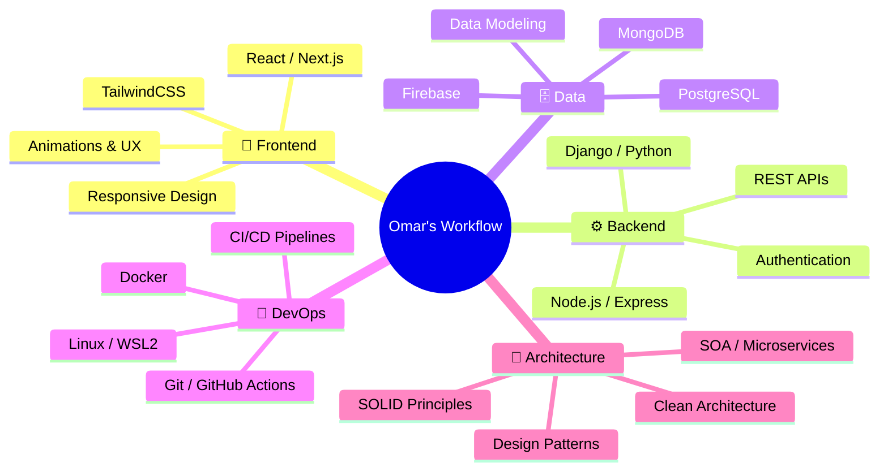

<svg width="1280" height="400" viewBox="0 0 1280 400" xmlns="http://www.w3.org/2000/svg">
  <defs>
    <!-- Fondo degradado radial -->
    <radialGradient id="bg" cx="50%" cy="50%" r="75%">
      <stop offset="0%" stop-color="#0a0f1e"/>
      <stop offset="100%" stop-color="#000000"/>
    </radialGradient>

    <!-- Glow azul para texto -->
    <filter id="glowBlue" x="-30%" y="-30%" width="160%" height="160%">
      <feGaussianBlur stdDeviation="6" result="blur"/>
      <feMerge><feMergeNode in="blur"/><feMergeNode in="SourceGraphic"/></feMerge>
    </filter>

    <!-- Glow suave para partículas -->
    <filter id="glowDot" x="-100%" y="-100%" width="300%" height="300%">
      <feGaussianBlur stdDeviation="2.5" result="blur"/>
      <feMerge><feMergeNode in="blur"/><feMergeNode in="SourceGraphic"/></feMerge>
    </filter>

    <!-- Animaciones keyframes -->
    <style>
      /* ── Partículas flotantes ── */
      .p { animation: float linear infinite; opacity: 0; }

      @keyframes float {
        0%   { opacity: 0; }
        10%  { opacity: 1; }
        90%  { opacity: 1; }
        100% { opacity: 0; transform: translate(var(--dx), var(--dy)); }
      }

      /* ── Líneas de conexión ── */
      .ln { animation: fadeLine ease-in-out infinite; opacity: 0; }

      @keyframes fadeLine {
        0%,100% { opacity: 0; }
        30%,70% { opacity: 0.28; }
      }

      /* ── Texto principal ── */
      .name {
        animation: fadeUp 1.6s ease forwards;
        opacity: 0;
      }
      .role {
        animation: fadeUp 1.6s ease 0.5s forwards;
        opacity: 0;
      }
      .loc {
        animation: fadeUp 1.6s ease 0.9s forwards;
        opacity: 0;
      }
      .divider {
        animation: expandLine 1.2s ease 0.7s forwards;
        transform-origin: center;
        transform: scaleX(0);
        opacity: 0;
      }

      @keyframes fadeUp {
        from { opacity: 0; transform: translateY(16px); }
        to   { opacity: 1; transform: translateY(0); }
      }
      @keyframes expandLine {
        from { transform: scaleX(0); opacity: 0; }
        to   { transform: scaleX(1); opacity: 1; }
      }

      /* ── Pulso central ── */
      .pulse {
        animation: pulse 3s ease-in-out infinite;
      }
      @keyframes pulse {
        0%,100% { r: 3; opacity: 0.6; }
        50%      { r: 5; opacity: 1;   }
      }
    </style>
  </defs>

  <!-- ── FONDO ────────────────────────────────────── -->
  <rect width="1280" height="400" fill="url(#bg)"/>

  <!-- ── LÍNEAS DE CONEXIÓN ──────────────────────── -->
  <line class="ln" x1="120" y1="60"  x2="310" y2="140" stroke="#0A84FF" stroke-width="0.7" style="animation-duration:4.2s; animation-delay:0.3s"/>
  <line class="ln" x1="310" y1="140" x2="490" y2="80"  stroke="#7C3AED" stroke-width="0.7" style="animation-duration:5.1s; animation-delay:0.8s"/>
  <line class="ln" x1="490" y1="80"  x2="680" y2="170" stroke="#0A84FF" stroke-width="0.7" style="animation-duration:3.9s; animation-delay:1.2s"/>
  <line class="ln" x1="680" y1="170" x2="870" y2="60"  stroke="#7C3AED" stroke-width="0.7" style="animation-duration:4.7s; animation-delay:0.5s"/>
  <line class="ln" x1="870" y1="60"  x2="1050" y2="130" stroke="#0A84FF" stroke-width="0.7" style="animation-duration:5.5s; animation-delay:1.5s"/>
  <line class="ln" x1="1050" y1="130" x2="1200" y2="50" stroke="#7C3AED" stroke-width="0.7" style="animation-duration:4.0s; animation-delay:0.2s"/>
  <line class="ln" x1="120" y1="60"  x2="200" y2="300" stroke="#0A84FF" stroke-width="0.7" style="animation-duration:6.0s; animation-delay:1.0s"/>
  <line class="ln" x1="200" y1="300" x2="420" y2="330" stroke="#7C3AED" stroke-width="0.7" style="animation-duration:4.4s; animation-delay:0.6s"/>
  <line class="ln" x1="420" y1="330" x2="600" y2="350" stroke="#0A84FF" stroke-width="0.7" style="animation-duration:3.8s; animation-delay:1.8s"/>
  <line class="ln" x1="600" y1="350" x2="800" y2="320" stroke="#7C3AED" stroke-width="0.7" style="animation-duration:5.3s; animation-delay:0.9s"/>
  <line class="ln" x1="800" y1="320" x2="1000" y2="360" stroke="#0A84FF" stroke-width="0.7" style="animation-duration:4.6s; animation-delay:1.3s"/>
  <line class="ln" x1="1000" y1="360" x2="1180" y2="300" stroke="#7C3AED" stroke-width="0.7" style="animation-duration:5.8s; animation-delay:0.4s"/>
  <line class="ln" x1="310" y1="140" x2="420" y2="330" stroke="#0A84FF" stroke-width="0.5" style="animation-duration:7.0s; animation-delay:2.0s"/>
  <line class="ln" x1="490" y1="80"  x2="600" y2="350" stroke="#7C3AED" stroke-width="0.5" style="animation-duration:6.5s; animation-delay:1.6s"/>
  <line class="ln" x1="870" y1="60"  x2="800" y2="320" stroke="#0A84FF" stroke-width="0.5" style="animation-duration:6.8s; animation-delay:2.2s"/>
  <line class="ln" x1="1050" y1="130" x2="1000" y2="360" stroke="#7C3AED" stroke-width="0.5" style="animation-duration:5.9s; animation-delay:0.7s"/>
  <line class="ln" x1="680" y1="170" x2="800" y2="320" stroke="#0A84FF" stroke-width="0.5" style="animation-duration:4.3s; animation-delay:1.1s"/>
  <line class="ln" x1="200" y1="300" x2="310" y2="140" stroke="#7C3AED" stroke-width="0.5" style="animation-duration:5.2s; animation-delay:0.1s"/>

  <!-- ── PARTÍCULAS ──────────────────────────────── -->
  <!-- Fila superior -->
  <circle class="p" cx="120"  cy="60"  r="2.2" fill="#0A84FF" filter="url(#glowDot)" style="--dx:15px;--dy:-12px; animation-duration:6s; animation-delay:0s"/>
  <circle class="p" cx="310"  cy="140" r="2.0" fill="#7C3AED" filter="url(#glowDot)" style="--dx:-10px;--dy:8px; animation-duration:7s; animation-delay:0.5s"/>
  <circle class="p" cx="490"  cy="80"  r="2.5" fill="#0A84FF" filter="url(#glowDot)" style="--dx:12px;--dy:15px; animation-duration:5s; animation-delay:1s"/>
  <circle class="p" cx="680"  cy="170" r="1.8" fill="#7C3AED" filter="url(#glowDot)" style="--dx:-8px;--dy:-10px; animation-duration:8s; animation-delay:0.3s"/>
  <circle class="p" cx="870"  cy="60"  r="2.3" fill="#0A84FF" filter="url(#glowDot)" style="--dx:10px;--dy:12px; animation-duration:6s; animation-delay:1.5s"/>
  <circle class="p" cx="1050" cy="130" r="2.0" fill="#7C3AED" filter="url(#glowDot)" style="--dx:-12px;--dy:-8px; animation-duration:7s; animation-delay:0.8s"/>
  <circle class="p" cx="1200" cy="50"  r="1.8" fill="#0A84FF" filter="url(#glowDot)" style="--dx:8px;--dy:10px; animation-duration:5s; animation-delay:2s"/>
  <!-- Fila inferior -->
  <circle class="p" cx="200"  cy="300" r="2.2" fill="#7C3AED" filter="url(#glowDot)" style="--dx:-10px;--dy:12px; animation-duration:6.5s; animation-delay:0.2s"/>
  <circle class="p" cx="420"  cy="330" r="2.0" fill="#0A84FF" filter="url(#glowDot)" style="--dx:15px;--dy:-8px; animation-duration:7.5s; animation-delay:1.2s"/>
  <circle class="p" cx="600"  cy="350" r="2.4" fill="#7C3AED" filter="url(#glowDot)" style="--dx:-12px;--dy:-15px; animation-duration:5.5s; animation-delay:0.6s"/>
  <circle class="p" cx="800"  cy="320" r="1.9" fill="#0A84FF" filter="url(#glowDot)" style="--dx:8px;--dy:10px; animation-duration:8.5s; animation-delay:1.8s"/>
  <circle class="p" cx="1000" cy="360" r="2.1" fill="#7C3AED" filter="url(#glowDot)" style="--dx:-10px;--dy:-8px; animation-duration:6.8s; animation-delay:0.4s"/>
  <circle class="p" cx="1180" cy="300" r="2.3" fill="#0A84FF" filter="url(#glowDot)" style="--dx:12px;--dy:-12px; animation-duration:7.2s; animation-delay:1.0s"/>
  <!-- Extras centrales -->
  <circle class="p" cx="50"   cy="200" r="1.6" fill="#0A84FF" filter="url(#glowDot)" style="--dx:10px;--dy:-5px; animation-duration:9s; animation-delay:0.9s"/>
  <circle class="p" cx="1230" cy="200" r="1.6" fill="#7C3AED" filter="url(#glowDot)" style="--dx:-10px;--dy:5px; animation-duration:9s; animation-delay:0.9s"/>
  <circle class="p" cx="350"  cy="200" r="1.4" fill="#7C3AED" filter="url(#glowDot)" style="--dx:8px;--dy:-8px; animation-duration:10s; animation-delay:2.5s"/>
  <circle class="p" cx="950"  cy="200" r="1.4" fill="#0A84FF" filter="url(#glowDot)" style="--dx:-8px;--dy:8px; animation-duration:10s; animation-delay:2.5s"/>

  <!-- ── TEXTO CENTRAL ───────────────────────────── -->
  <!-- Nombre -->
  <text
    class="name"
    x="640" y="168"
    text-anchor="middle"
    font-family="'Segoe UI', Helvetica, Arial, sans-serif"
    font-size="52"
    font-weight="300"
    letter-spacing="6"
    fill="#ffffff"
    filter="url(#glowBlue)"
  >Omar Hernández Rey</text>

  <!-- Línea divisora -->
  <line
    class="divider"
    x1="560" y1="190" x2="720" y2="190"
    stroke="url(#divGrad)"
    stroke-width="1.5"
  />
  <defs>
    <linearGradient id="divGrad" x1="0%" y1="0%" x2="100%" y2="0%">
      <stop offset="0%"   stop-color="transparent"/>
      <stop offset="30%"  stop-color="#0A84FF"/>
      <stop offset="70%"  stop-color="#7C3AED"/>
      <stop offset="100%" stop-color="transparent"/>
    </linearGradient>
  </defs>

  <!-- Rol -->
  <text
    class="role"
    x="640" y="226"
    text-anchor="middle"
    font-family="'Segoe UI', Helvetica, Arial, sans-serif"
    font-size="20"
    font-weight="300"
    letter-spacing="4"
    fill="#a0a8b8"
  >Full Stack Developer</text>

  <!-- Ubicación -->
  <text
    class="loc"
    x="640" y="258"
    text-anchor="middle"
    font-family="'Segoe UI', Helvetica, Arial, sans-serif"
    font-size="12"
    font-weight="400"
    letter-spacing="3"
    fill="#4a5568"
  >BOGOTÁ, COLOMBIA</text>
</svg>

<!-- ═══════════════════════════════════════════════════════════════════ -->
<!-- 🔗 SOCIAL BADGES -->
<!-- ═══════════════════════════════════════════════════════════════════ -->
<a href="https://omarh-portafolio-web.vercel.app/">
  
</a>&nbsp;
<a href="https://linkedin.com/in/omarhernandezrey">
  
</a>&nbsp;
<a href="https://github.com/omarhernandezrey">
  
</a>&nbsp;
<a href="mailto:contact@omarhernandez.dev">
  
</a>

<br/><br/>

<!-- Profile Views Counter -->

&nbsp;


</div>

<!-- ═══════════════════════════════════════════════════════════════════ -->
<!-- 🧑‍💻 ABOUT ME -->
<!-- ═══════════════════════════════════════════════════════════════════ -->


## 🧑‍💻 &nbsp;About Me

```yaml
name: Omar Alberto Hernández Rey
location: Bogotá, Colombia 🇨🇴
role: Full Stack Developer
education: Politécnico Grancolombiano
current_focus:
  - Mobile Development (Android/Java)
  - Software Architecture & Design Patterns
  - Scalable Web Applications
languages: [Spanish (Native), English]
fun_fact: "I automate everything I can — even my README updates."
```

- 🔭 &nbsp;Currently working on **interactive educational platforms**
- 🌱 &nbsp;Learning **Software Architecture, Mobile Development & SOA Patterns**
- 🏗️ &nbsp;Building with **React, Next.js, Node.js, Django**
- ⚡ &nbsp;Passionate about **clean code, design patterns & developer experience**
- 🎯 &nbsp;2026 Goals: **Contribute to Open Source & Launch SaaS projects**

<br clear="both"/>

<!-- ═══════════════════════════════════════════════════════════════════ -->
<!-- 🛠️ TECH STACK — KBD CONTAINERS -->
<!-- ═══════════════════════════════════════════════════════════════════ -->
<div align="center">

## 🛠️ &nbsp;Tech Arsenal

<br/>

<p style="display: inline-block;" align="center">
  <kbd>
    <kbd>Front-end</kbd>
    <br><br>
    
    
    
    
    
  </kbd>
  <kbd>
    <kbd>Frameworks / UI</kbd>
    <br><br>
    
    
    
    
    
  </kbd>
  <kbd>
    <kbd>Back-end</kbd>
    <br><br>
    
    
    
    
    
  </kbd>
</p>

<br/>

<p style="display: inline-block;" align="center">
  <kbd>
    <kbd>Databases</kbd>
    <br><br>
    
    
    
    
  </kbd>
  <kbd>
    <kbd>DevOps & Infra</kbd>
    <br><br>
    
    
    
    
    
  </kbd>
  <kbd>
    <kbd>Tools</kbd>
    <br><br>
    
    
    
    
    
  </kbd>
</p>

</div>

<!-- ═══════════════════════════════════════════════════════════════════ -->
<!-- 📊 GITHUB ANALYTICS DASHBOARD -->
<!-- ═══════════════════════════════════════════════════════════════════ -->
<div align="center">

## 📊 &nbsp;GitHub Analytics

<br/>

<a href="https://github.com/omarhernandezrey">
  
  &nbsp;
  
</a>

<br/><br/>

<a href="https://github.com/omarhernandezrey">
  
</a>

<br/><br/>

<a href="https://github.com/omarhernandezrey">
  
</a>

</div>

<!-- ═══════════════════════════════════════════════════════════════════ -->
<!-- 🏆 GITHUB TROPHIES -->
<!-- ═══════════════════════════════════════════════════════════════════ -->
<div align="center">

## 🏆 &nbsp;GitHub Trophies

<br/>

<a href="https://github.com/omarhernandezrey">
  
</a>

</div>

<!-- ═══════════════════════════════════════════════════════════════════ -->
<!-- 📂 FEATURED PROJECTS -->
<!-- ═══════════════════════════════════════════════════════════════════ -->
<div align="center">

## ⭐ &nbsp;Featured Projects

<br/>

<a href="https://omarh-portafolio-web.vercel.app/">
  
</a>

</div>

<!-- ═══════════════════════════════════════════════════════════════════ -->
<!-- 🐍 SNAKE CONTRIBUTION ANIMATION -->
<!-- ═══════════════════════════════════════════════════════════════════ -->
<div align="center">

## 🐍 &nbsp;Watch the Snake Eat My Contributions

<br/>

<picture>
  <source media="(prefers-color-scheme: dark)" srcset="https://raw.githubusercontent.com/omarhernandezrey/omarhernandezrey/output/github-contribution-grid-snake-dark.svg" />
  <source media="(prefers-color-scheme: light)" srcset="https://raw.githubusercontent.com/omarhernandezrey/omarhernandezrey/output/github-contribution-grid-snake.svg" />
  
</picture>

</div>

<!-- ═══════════════════════════════════════════════════════════════════ -->
<!-- 📋 SUMMARY CARDS -->
<!-- ═══════════════════════════════════════════════════════════════════ -->
<div align="center">

## 📋 &nbsp;Profile Summary

<br/>

<a href="https://github.com/omarhernandezrey">
  
</a>

<br/><br/>

<a href="https://github.com/omarhernandezrey">
  
  
  
</a>

</div>

<!-- ═══════════════════════════════════════════════════════════════════ -->
<!-- 💼 EXPERIENCE & WORKFLOW -->
<!-- ═══════════════════════════════════════════════════════════════════ -->
<div align="center">

## 💼 &nbsp;How I Work

</div>



<!-- ═══════════════════════════════════════════════════════════════════ -->
<!-- 🎵 RANDOM DEV QUOTE -->
<!-- ═══════════════════════════════════════════════════════════════════ -->
<div align="center">

## 💭 &nbsp;Random Dev Quote

<br/>

<a href="https://github.com/omarhernandezrey">
  
</a>

</div>

<!-- ═══════════════════════════════════════════════════════════════════ -->
<!-- 🤝 LET'S CONNECT -->
<!-- ═══════════════════════════════════════════════════════════════════ -->
<div align="center">

## 🤝 &nbsp;Let's Connect

<br/>

<a href="https://omarh-portafolio-web.vercel.app/">
  
</a>&nbsp;
<a href="https://linkedin.com/in/omarhernandezrey">
  
</a>&nbsp;
<a href="mailto:contact@omarhernandez.dev">
  
</a>&nbsp;
<a href="https://github.com/omarhernandezrey">
  
</a>

<br/><br/>

💡 **Open to collaborations on innovative projects!**

<br/>

> *"First, solve the problem. Then, write the code."* — John Johnson

<br/>


</div>

<!-- ═══════════════════════════════════════════════════════════════════ -->
<!-- 💖 MADE WITH LOVE -->
<!-- ═══════════════════════════════════════════════════════════════════ -->
<div align="center">
  <sub>⚡ Crafted with passion by <a href="https://github.com/omarhernandezrey">Omar Hernández Rey</a> — <i>Build. Break. Learn. Ship. Repeat.</i> ⚡</sub>
</div>
