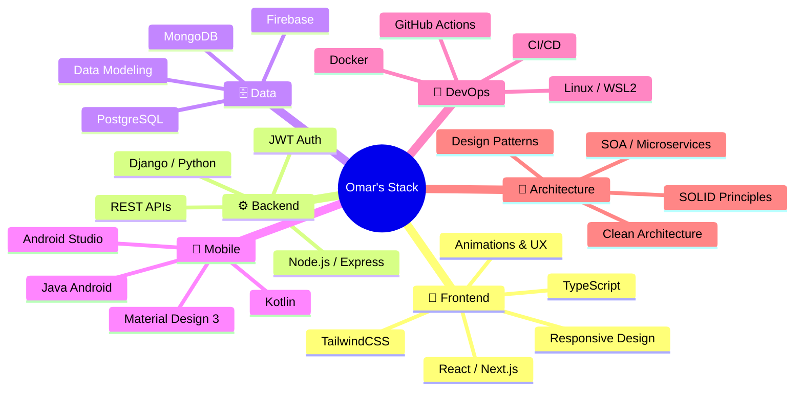

<div align="center">

<!-- ══════════════════════════════════════════════════════════
     🌊  HEADER
════════════════════════════════════════════════════════════ -->


<!-- ══════════════════════════════════════════════════════════
     ✍️  TYPING SVG
════════════════════════════════════════════════════════════ -->
<a href="https://git.io/typing-svg">
  
</a>

<br/>

<!-- ══════════════════════════════════════════════════════════
     🔗  BADGES SOCIALES
════════════════════════════════════════════════════════════ -->
<a href="https://omarh-portafolio-web.vercel.app/" target="_blank">
  
</a>&nbsp;
<a href="https://linkedin.com/in/omarhernandezrey" target="_blank">
  
</a>&nbsp;
<a href="https://github.com/omarhernandezrey" target="_blank">
  
</a>&nbsp;
<a href="mailto:contact@omarhernandez.dev" target="_blank">
  
</a>

<br/><br/>


&nbsp;


</div>

---

<!-- ══════════════════════════════════════════════════════════
     🧑‍💻  ABOUT ME — GRID 2 COL
════════════════════════════════════════════════════════════ -->
<table width="100%">
<tr>
<td width="55%" valign="top">

## 🧑‍💻 &nbsp;About Me

```yaml
name    : Omar Alberto Hernández Rey
from    : Bogotá, Colombia 🇨🇴
role    : Full Stack & Mobile Developer
school  : Politécnico Grancolombiano
focus   :
  - Scalable Web Applications
  - Android / Kotlin Mobile Dev
  - Software Architecture & SOA
  - Clean Code & Design Patterns
stack   : React · Next.js · Node · TS · Kotlin
open_to : Remote roles & collaborations
```

- 🔭 &nbsp;Building **interactive educational platforms**
- 📱 &nbsp;Developing **Android apps** with Kotlin & Android Studio
- 🌱 &nbsp;Deep-diving into **SOA, Microservices & Clean Architecture**
- ⚡ &nbsp;Passionate about **DX, performance & scalable systems**
- 🎯 &nbsp;2026: **Open Source contributions & SaaS launches**

</td>
<td width="45%" valign="top" align="center">

<br/><br/>


<br/>


</td>
</tr>
</table>

---

<!-- ══════════════════════════════════════════════════════════
     🛠️  TECH STACK — KBD GRID
════════════════════════════════════════════════════════════ -->
<div align="center">

## 🛠️ &nbsp;Tech Arsenal

<br/>

<!-- FILA 1 -->
<table>
<tr>
<td align="center" valign="top">
<kbd>
<kbd>🎨 Front-end</kbd>
<br/><br/>
&nbsp;
&nbsp;
&nbsp;
&nbsp;

</kbd>
</td>
<td align="center" valign="top">
<kbd>
<kbd>⚛️ Frameworks / UI</kbd>
<br/><br/>
&nbsp;
&nbsp;
&nbsp;
&nbsp;

</kbd>
</td>
<td align="center" valign="top">
<kbd>
<kbd>⚙️ Back-end</kbd>
<br/><br/>
&nbsp;
&nbsp;
&nbsp;
&nbsp;

</kbd>
</td>
</tr>
</table>

<br/>

<!-- FILA 2 -->
<table>
<tr>
<td align="center" valign="top">
<kbd>
<kbd>🗄️ Databases</kbd>
<br/><br/>
&nbsp;
&nbsp;
&nbsp;

</kbd>
</td>
<td align="center" valign="top">
<kbd>
<kbd>📱 Mobile Dev</kbd>
<br/><br/>
&nbsp;
&nbsp;
&nbsp;

</kbd>
</td>
<td align="center" valign="top">
<kbd>
<kbd>🚀 DevOps & Tools</kbd>
<br/><br/>
&nbsp;
&nbsp;
&nbsp;
&nbsp;
&nbsp;

</kbd>
</td>
</tr>
</table>

</div>

---

<!-- ══════════════════════════════════════════════════════════
     📊  GITHUB ANALYTICS — GRID
════════════════════════════════════════════════════════════ -->
<div align="center">

## 📊 &nbsp;GitHub Analytics

<br/>

<!-- Stats + Langs -->
<table width="100%">
<tr>
<td align="center" width="55%">

</td>
<td align="center" width="45%">

</td>
</tr>
</table>

<br/>

<!-- Streak -->


<br/><br/>

<!-- Activity Graph -->


</div>

---

<!-- ══════════════════════════════════════════════════════════
     🏆  TROPHIES
════════════════════════════════════════════════════════════ -->
<div align="center">

## 🏆 &nbsp;GitHub Trophies

<br/>


</div>

---

<!-- ══════════════════════════════════════════════════════════
     ⭐  FEATURED PROJECTS — GRID
════════════════════════════════════════════════════════════ -->
<div align="center">

## ⭐ &nbsp;Featured Projects

<br/>

<table>
<tr>
<td align="center">
<a href="https://omarh-portafolio-web.vercel.app/">
  
</a>
</td>
<td align="center">
<a href="https://github.com/omarhernandezrey">
  
</a>
</td>
</tr>
</table>

</div>

---

<!-- ══════════════════════════════════════════════════════════
     🐍  SNAKE
════════════════════════════════════════════════════════════ -->
<div align="center">

## 🐍 &nbsp;Watch the Snake Eat My Contributions

<br/>

<picture>
  <source media="(prefers-color-scheme: dark)"  srcset="https://raw.githubusercontent.com/omarhernandezrey/omarhernandezrey/output/github-contribution-grid-snake-dark.svg"/>
  <source media="(prefers-color-scheme: light)" srcset="https://raw.githubusercontent.com/omarhernandezrey/omarhernandezrey/output/github-contribution-grid-snake.svg"/>
  
</picture>

</div>

---

<!-- ══════════════════════════════════════════════════════════
     📋  PROFILE SUMMARY CARDS — GRID 3 COL
════════════════════════════════════════════════════════════ -->
<div align="center">

## 📋 &nbsp;Profile Summary

<br/>


<br/><br/>

<table width="100%">
<tr>
<td align="center" width="33%">

</td>
<td align="center" width="33%">

</td>
<td align="center" width="34%">

</td>
</tr>
</table>

</div>

---

<!-- ══════════════════════════════════════════════════════════
     💼  WORKFLOW MINDMAP
════════════════════════════════════════════════════════════ -->
<div align="center">

## 💼 &nbsp;How I Work

</div>



---

<!-- ══════════════════════════════════════════════════════════
     💭  QUOTE
════════════════════════════════════════════════════════════ -->
<div align="center">

## 💭 &nbsp;Dev Quote

<br/>


</div>

---

<!-- ══════════════════════════════════════════════════════════
     🤝  CONNECT — GRID
════════════════════════════════════════════════════════════ -->
<div align="center">

## 🤝 &nbsp;Let's Connect

<br/>

<table>
<tr>
<td align="center">
  <a href="https://omarh-portafolio-web.vercel.app/">
    
  </a>
</td>
<td align="center">
  <a href="https://linkedin.com/in/omarhernandezrey">
    
  </a>
</td>
<td align="center">
  <a href="mailto:contact@omarhernandez.dev">
    
  </a>
</td>
<td align="center">
  <a href="https://github.com/omarhernandezrey">
    
  </a>
</td>
</tr>
</table>

<br/>

> 💡 **Open to remote roles, freelance projects & open source collaborations**

<br/>

> *"First, solve the problem. Then, write the code."* — John Johnson

<br/>

<!-- FOOTER WAVE -->


</div>

<!-- ══════════════════════════════════════════════════════════
     💖  CRÉDITOS
════════════════════════════════════════════════════════════ -->
<div align="center">
  <sub>⚡ Crafted with passion by <a href="https://github.com/omarhernandezrey">Omar Hernández Rey</a> — <em>Build. Break. Learn. Ship. Repeat.</em> ⚡</sub>
</div>
