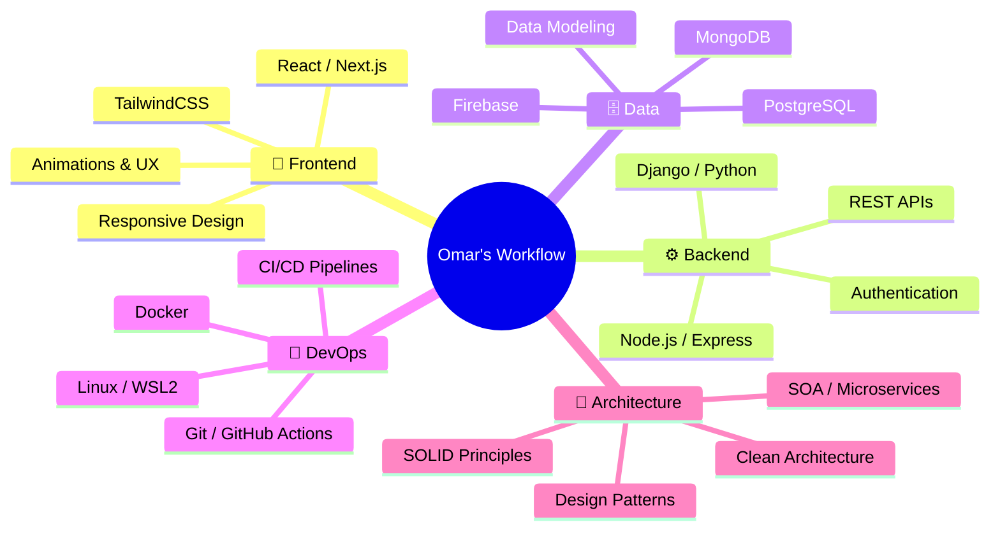

<div align="center">

<!-- ═══════════════════════════════════════════════════════════════════ -->
<!-- 🎬 ANIMATED PARTICLE HEADER — SVG (sube profile-animation.svg     -->
<!-- a la raíz del repo omarhernandezrey/omarhernandezrey)             -->
<!-- ═══════════════════════════════════════════════════════════════════ -->
<a href="https://omarh-portafolio-web.vercel.app/" target="_blank">
  
</a>

<br/><br/>

<!-- ═══════════════════════════════════════════════════════════════════ -->
<!-- 🔗 SOCIAL BADGES -->
<!-- ═══════════════════════════════════════════════════════════════════ -->
<a href="https://omarh-portafolio-web.vercel.app/">
  
</a>&nbsp;
<a href="https://linkedin.com/in/omarhernandezrey">
  
</a>&nbsp;
<a href="https://github.com/omarhernandezrey">
  
</a>&nbsp;
<a href="mailto:contact@omarhernandez.dev">
  
</a>

<br/><br/>

<!-- Profile Views Counter -->

&nbsp;


</div>

<!-- ═══════════════════════════════════════════════════════════════════ -->
<!-- 🧑‍💻 ABOUT ME -->
<!-- ═══════════════════════════════════════════════════════════════════ -->


## 🧑‍💻 &nbsp;About Me

```yaml
name: Omar Alberto Hernández Rey
location: Bogotá, Colombia 🇨🇴
role: Full Stack Developer
education: Politécnico Grancolombiano
current_focus:
  - Mobile Development (Android/Java)
  - Software Architecture & Design Patterns
  - Scalable Web Applications
languages: [Spanish (Native), English]
fun_fact: "I automate everything I can — even my README updates."
```

- 🔭 &nbsp;Currently working on **interactive educational platforms**
- 🌱 &nbsp;Learning **Software Architecture, Mobile Development & SOA Patterns**
- 🏗️ &nbsp;Building with **React, Next.js, Node.js, Django**
- ⚡ &nbsp;Passionate about **clean code, design patterns & developer experience**
- 🎯 &nbsp;2026 Goals: **Contribute to Open Source & Launch SaaS projects**

<br clear="both"/>

<!-- ═══════════════════════════════════════════════════════════════════ -->
<!-- 🛠️ TECH STACK — KBD CONTAINERS -->
<!-- ═══════════════════════════════════════════════════════════════════ -->
<div align="center">

## 🛠️ &nbsp;Tech Arsenal

<br/>

<p style="display: inline-block;" align="center">
  <kbd>
    <kbd>Front-end</kbd>
    <br><br>
    
    
    
    
    
  </kbd>
  <kbd>
    <kbd>Frameworks / UI</kbd>
    <br><br>
    
    
    
    
    
  </kbd>
  <kbd>
    <kbd>Back-end</kbd>
    <br><br>
    
    
    
    
    
  </kbd>
</p>

<br/>

<p style="display: inline-block;" align="center">
  <kbd>
    <kbd>Databases</kbd>
    <br><br>
    
    
    
    
  </kbd>
  <kbd>
    <kbd>DevOps & Infra</kbd>
    <br><br>
    
    
    
    
    
  </kbd>
  <kbd>
    <kbd>Tools</kbd>
    <br><br>
    
    
    
    
    
  </kbd>
</p>

</div>

<!-- ═══════════════════════════════════════════════════════════════════ -->
<!-- 📊 GITHUB ANALYTICS DASHBOARD -->
<!-- ═══════════════════════════════════════════════════════════════════ -->
<div align="center">

## 📊 &nbsp;GitHub Analytics

<br/>

<a href="https://github.com/omarhernandezrey">
  
  &nbsp;
  
</a>

<br/><br/>

<a href="https://github.com/omarhernandezrey">
  
</a>

<br/><br/>

<a href="https://github.com/omarhernandezrey">
  
</a>

</div>

<!-- ═══════════════════════════════════════════════════════════════════ -->
<!-- 🏆 GITHUB TROPHIES -->
<!-- ═══════════════════════════════════════════════════════════════════ -->
<div align="center">

## 🏆 &nbsp;GitHub Trophies

<br/>

<a href="https://github.com/omarhernandezrey">
  
</a>

</div>

<!-- ═══════════════════════════════════════════════════════════════════ -->
<!-- 📂 FEATURED PROJECTS -->
<!-- ═══════════════════════════════════════════════════════════════════ -->
<div align="center">

## ⭐ &nbsp;Featured Projects

<br/>

<a href="https://omarh-portafolio-web.vercel.app/">
  
</a>

</div>

<!-- ═══════════════════════════════════════════════════════════════════ -->
<!-- 🐍 SNAKE CONTRIBUTION ANIMATION -->
<!-- ═══════════════════════════════════════════════════════════════════ -->
<div align="center">

## 🐍 &nbsp;Watch the Snake Eat My Contributions

<br/>

<picture>
  <source media="(prefers-color-scheme: dark)" srcset="https://raw.githubusercontent.com/omarhernandezrey/omarhernandezrey/output/github-contribution-grid-snake-dark.svg" />
  <source media="(prefers-color-scheme: light)" srcset="https://raw.githubusercontent.com/omarhernandezrey/omarhernandezrey/output/github-contribution-grid-snake.svg" />
  
</picture>

</div>

<!-- ═══════════════════════════════════════════════════════════════════ -->
<!-- 📋 SUMMARY CARDS -->
<!-- ═══════════════════════════════════════════════════════════════════ -->
<div align="center">

## 📋 &nbsp;Profile Summary

<br/>

<a href="https://github.com/omarhernandezrey">
  
</a>

<br/><br/>

<a href="https://github.com/omarhernandezrey">
  
  
  
</a>

</div>

<!-- ═══════════════════════════════════════════════════════════════════ -->
<!-- 💼 EXPERIENCE & WORKFLOW -->
<!-- ═══════════════════════════════════════════════════════════════════ -->
<div align="center">

## 💼 &nbsp;How I Work

</div>



<!-- ═══════════════════════════════════════════════════════════════════ -->
<!-- 🎵 RANDOM DEV QUOTE -->
<!-- ═══════════════════════════════════════════════════════════════════ -->
<div align="center">

## 💭 &nbsp;Random Dev Quote

<br/>

<a href="https://github.com/omarhernandezrey">
  
</a>

</div>

<!-- ═══════════════════════════════════════════════════════════════════ -->
<!-- 🤝 LET'S CONNECT -->
<!-- ═══════════════════════════════════════════════════════════════════ -->
<div align="center">

## 🤝 &nbsp;Let's Connect

<br/>

<a href="https://omarh-portafolio-web.vercel.app/">
  
</a>&nbsp;
<a href="https://linkedin.com/in/omarhernandezrey">
  
</a>&nbsp;
<a href="mailto:contact@omarhernandez.dev">
  
</a>&nbsp;
<a href="https://github.com/omarhernandezrey">
  
</a>

<br/><br/>

💡 **Open to collaborations on innovative projects!**

<br/>

> *"First, solve the problem. Then, write the code."* — John Johnson

<br/>


</div>

<!-- ═══════════════════════════════════════════════════════════════════ -->
<!-- 💖 MADE WITH LOVE -->
<!-- ═══════════════════════════════════════════════════════════════════ -->
<div align="center">
  <sub>⚡ Crafted with passion by <a href="https://github.com/omarhernandezrey">Omar Hernández Rey</a> — <i>Build. Break. Learn. Ship. Repeat.</i> ⚡</sub>
</div>
